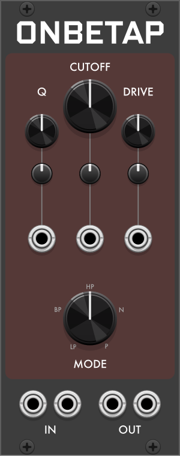
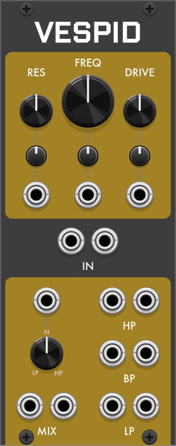
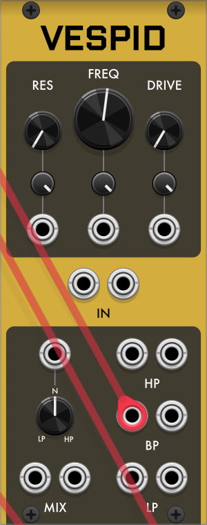

# Robot Boy Filters: MF-20, Onbetap & Vespid

Robot Boy includes three filters, each modeling a famous analog filter with a strong personality: the Korg MS-20, the Soviet Polivoks, and the EDP Wasp. This is the combined manual for all three. Each is modeled from the behavior of the original circuit — the way it distorts and rings — rather than a clean filter with a distortion stage added, so the character is built in rather than dialed on.

All three are stereo (the right input is normalled to the left, so a mono patch fills both sides) and polyphonic, and run on both [VCV Rack](https://vcvrack.com) and the [4ms MetaModule](https://4mscompany.com/metamodule). Each also has a **Drive** control that pushes the signal into the circuit's own nonlinearities — where much of each filter's character lives, and where they differ most.

What mainly separates them is how they resonate. The MS-20 has two filters in series and screams when pushed. The Polivoks has an inverse relationship between drive and resonance — the harder you push the input, the *less* it rings. The Wasp sits right at the edge of self-oscillation and can be nudged over it. The sections below cover each in full.

- [MF-20 — the Korg MS-20 filter](#mf-20--the-korg-ms-20-filter)
- [Onbetap — the Formanta Polivoks filter](#onbetap--the-formanta-polivoks-filter)
- [Vespid — the EDP Wasp filter](#vespid--the-edp-wasp-filter)
- [At a glance](#at-a-glance)

---

## MF-20 — the Korg MS-20 filter

### The original

The **Korg MS-20** (1978) is a semi-modular monophonic synth that became one of the most sampled and cloned instruments ever made. Much of its reputation rests on its filter, which is unusually aggressive at high resonance and cuts through a mix.

Korg built that filter two different ways over the instrument's life, and players still argue over which is better. Early units (1978–79) used a Korg-made chip, the **Korg-35**, in a Sallen-Key design; later units (1979 onward) switched to the more common **LM13600** transconductance amplifier. The early Korg-35 version is edgier, with a rawer distortion; the later chip is smoother, especially at maximum resonance. MF-20 gives you both, switchable in the right-click menu.

### How it works

As on the MS-20, the signal passes through the **high-pass filter first, then the low-pass** — the two are in series. Sweeping them against each other opens a band or a notch, which is where a lot of the MS-20's vocal, wah-like sounds come from. Both filters self-oscillate cleanly at maximum resonance, so either can be played as a raw sine-ish voice. **Drive** overdrives the input for saturation and harmonic color.

The two cutoffs have independent knobs. To sweep them together the way the MS-20's shared cutoff modulation does, patch the **Total** cutoff input — it moves both at once, holding the band or notch shape while shifting it in frequency.

### Controls

- **HP Cutoff** — high-pass cutoff, 20 Hz – 20 kHz (log), default 120 Hz.
- **HP Peak** — high-pass resonance, 0–100%. Self-oscillates at 100%.
- **LP Cutoff** — low-pass cutoff, 20 Hz – 20 kHz (log), default 750 Hz.
- **LP Peak** — low-pass resonance, 0–100%. Self-oscillates at 100%.
- **Drive** — 1× to 8×. At 1× the filter is clean; raising it drives the input into soft clipping.

The two filters are always independent at the knob level; use the **Total** input (below) to move them together.

### I/O

- **Audio in (L / R)** — patch L only for mono (it feeds both sides), or both for true stereo.
- **Audio out (L / R)** — the filtered output (low-pass end of the HP→LP chain).
- **LP Cutoff CV** and **HP Cutoff CV** — modulate each cutoff independently, each with its own attenuverter (±1×).
- **Total Cutoff CV** — sweeps **both** cutoffs together, with its own attenuverter. This is the input to reach for filter sweeps that keep the band/notch intact.

(Resonance and Drive have no CV inputs.)

### Right-click menu

- **Filter revision** — **OTA (revised MS-20)**, based on the later LM13600 design (smoother, more open), or **Korg35 (original MS-20)**, the early chip (edgier, grittier distortion).

MF-20 is polyphonic on both hosts.

### Under the hood

Both revisions use a zero-delay-feedback (TPT) implementation. The OTA mode models the LM13600 topology with diode saturation in the resonance feedback path; the Korg35 mode puts the nonlinearity in the forward (input) path with slightly asymmetric clipping, which produces the even-order harmonics that give the original its character.

### Sources

- Stinchcombe, T. (2006). [*A Study of the Korg MS10 & MS20 Filters*](https://www.timstinchcombe.co.uk/synth/MS20_study.pdf) — circuit analysis of both filter revisions.
- Huovilainen, A. (2010). [*Design of a Scalable Polyphony-MIDI Synthesizer for a Low Cost DSP*](https://aaltodoc.aalto.fi/server/api/core/bitstreams/38b49bc4-2587-4e26-9851-8e05e06894da/content) — the zero-delay-feedback filter discretization.

---

## Onbetap — the Formanta Polivoks filter

### The original

The **Polivoks** (1982) is the best-known synthesizer to come out of the Soviet Union. It was designed by engineer Vladimir Kuzmin at the Formanta radio factory — its tank-like industrial look styled by his wife, Olimpiada, after Soviet military radios — and built in the tens of thousands for the domestic market, almost unknown in the West until long after the USSR was gone. (Kuzmin died in June 2026.)

Its filter is famous for an extreme, slightly unstable resonance and a thick, buzzy distortion. Part of the reason is a genuinely unusual circuit: it's built from Soviet op-amp chips run in an unconventional way, with **no capacitors** in the usual filter positions at all. Onbetap models that circuit's behavior directly.

### Behavior worth knowing

A few of Onbetap's behaviors run counter to what most filters do — they're the heart of the Polivoks sound:

- **Drive fights resonance.** On most filters, pushing the input harder makes the resonance ring louder. Here it's the reverse: a loud signal rings *less* than a quiet one at the same resonance setting. So Drive is effectively a second, inverse control over how much the filter sings — play softly and it howls, push hard and the peak ducks while the tone thickens.
- **The self-oscillation point moves with cutoff.** Oscillation begins earlier on the resonance knob when the cutoff is high than when it's low, so the filter feels more on-edge in its upper range.
- **It can turn suddenly harsh at the top of resonance**, dropping into a lower, harsher tone than the resonant frequency — the same surprise real units are known for.
- **No bass loss at high resonance.** The low end stays present under the sound even with resonance pushed hard.

### Controls

- **Cutoff** — 20 Hz – 20 kHz (log), default 750 Hz. 1 V/octave CV input, scaled by its attenuverter.
- **Q** (resonance) — 0–100%. Self-oscillation begins around three-quarters of the way up (earlier at high cutoff — see above). Its CV input covers the full range from a 0–5 V envelope at full attenuverter.
- **Drive** — 0–100%, roughly −12 to +24 dB into the core. Adds asymmetric-clipping grit and, characteristically, suppresses resonance as you push it. At the very top the tone keeps thickening even as the resonant ring is choked off, so more Drive never means a softer sound. CV input with attenuverter.
- **Mode** — a five-position knob: **Lowpass** (12 dB/oct), **Bandpass** (6 dB/oct — the circuit's two native outputs), **Highpass**, **Notch**, and **Peak**. Lowpass and Bandpass are what the hardware actually had; the other three are extensions built from the same solved core. Mode changes crossfade over 5 ms to avoid clicks (except in Vintage — see below).

### I/O

- **Audio in / out** — stereo. The right input is normalled to the left; patch the right input to run true independent stereo.

Onbetap is polyphonic on both hosts (voice count follows the wider of the two input channel counts).

### Right-click menu

- **Character** — **Tamed** (default), a calibrated, stable version of the circuit; or **Vintage**, which layers in the imperfections of a real, aging unit: a slow drift of cutoff (independent per channel), a fixed mismatch between the two filter stages, a per-unit DC offset that produces a thump on fast cutoff sweeps, and a hard (unfaded) mode switch. It's all seeded, so a given patch drifts the same way every time you load it.
- **Resonance limiting** — **Soft** (default) or **Hard**. The two behave almost identically at full resonance; the audible difference is mainly in pitch and behavior near the onset of oscillation.
- **Oversampling** — 1× / **2×** (default) / 4×. 4× reduces aliasing at maximum drive at roughly double the CPU cost; 1× is available for CPU-constrained patches.

### Under the hood

The model was derived from factory Polivoks schematics, the Erica Synths DIY Polivoks VCF, and the physics of the К140УД12 programmable op-amp (there are no RC time constants in the core — cutoff is set by the op-amps' own bias current), rather than from a generic filter-plus-saturator. It's a nonlinear core, not a linear filter with distortion added.

### Sources

- Marc Bareille, [*Polivoks VCF*](http://m.bareille.free.fr/modular1/vcf_polivoks/vcf_polivoks.htm) — build-verified circuit analysis, with a [redrawn schematic (PDF)](http://m.bareille.free.fr/modular1/vcf_polivoks/polivoks_schem.pdf) and a scan of the [original factory schematic](http://m.bareille.free.fr/modular1/vcf_polivoks/vcf_polivoks_sh0.gif).
- Erica Synths, [DIY Polivoks VCF schematic](https://github.com/erica-synths/diy-eurorack) — a legible component-for-component redraw of the factory circuit.
- [К140УД12 / КР140УД12 datasheet](https://rudatasheet.ru/microchips/k140ud12_kr140ud12/) and Texas Instruments, [*Application Note 71: Micropower Circuits Using the LM4250 Programmable Op Amp*](https://www.ti.com/lit/an/snoa652b/snoa652b.pdf) — the programmable-op-amp physics behind bias-current-set cutoff (the К140УД12 is a Soviet µA776 copy; the LM4250 is its Western analogue).

---

## Vespid — the EDP Wasp filter

### The original

The **Wasp** (1978) was made by **Electronic Dream Plant**, a small British company run by musician Adrian Wagner and engineer Chris Huggett. It was famously make-do: cheap, light, in a black-and-yellow plastic case (hence the name) with a flat touch-plate keyboard and a built-in speaker. It became a cult favorite and turned up with the likes of Devo and the Eurythmics.

Its filter is famous for *how* it was built. To save money, EDP used cheap digital logic chips — meant for on/off switching — and ran them as analog amplifiers, well outside their intended use. The result is a filter with a gritty, buzzy character all its own. It's been cloned many times; the best known is **Doepfer's A-124**, which is where a lot of modular players first met the sound. Vespid models both the original and the A-124's mod.

### How it works

Vespid is a multimode state-variable filter, and it gives you all its outputs at once — **low-pass, band-pass, and high-pass**, each as a stereo pair — plus a **Mix** output whose **Blend** knob crossfades from low-pass, through a notch at center, to high-pass. So you can pull three responses from one filter simultaneously, or morph between low and high on a single control (and modulate that morph with CV).

The original Wasp sits right at the verge of self-oscillation — enough to whistle and chirp, but it never quite runs away. Doepfer's clone added a mod that pushes it over into full self-oscillation. Vespid offers both as a **Character** switch (see the menu).

### Controls

- **Freq** — cutoff, 20 Hz – 20 kHz (log), default 750 Hz. Tracks 1 V/octave through its CV input, scaled by its attenuverter.
- **Res** — resonance, 0–100%, default 0. CV input with attenuverter.
- **Drive** — 0–100%, a 30 dB gain sweep into the filter, level-staged per Character mode to match the hardware each mode models. In **Screaming**, drive 0 is a hot Eurorack signal into the Doepfer circuit — clean, with clipping arriving just up the knob. In **Tame**, drive 0 is the original Wasp's own oscillator level into its +5 V circuit — already lightly overdriven, the classic "dirty Wasp" rasp, thickening from there. Pushing either mode further shifts the clipping from ragged and asymmetric toward a harder, odd-harmonic squareness. CV input with attenuverter.
- **Blend** — crossfades the **Mix** output: fully counter-clockwise is low-pass, center (default) is a notch, fully clockwise is high-pass. It affects only the Mix output; the dedicated LP/BP/HP outputs are always available unblended.

Each of Freq, Res, and Drive has its own CV input and attenuverter; Blend has a CV input (no attenuverter).

### I/O

- **In (L / R)** — audio in; patch L only for mono (it feeds both sides), or both for true stereo.
- **Freq / Res / Drive CV** — modulate those controls, scaled by their attenuverters.
- **Blend CV** — modulates the Mix crossfade.
- **HP / BP / LP outputs** — the three filter responses, each a stereo pair, all live at once.
- **Mix output** — the LP–notch–HP blend set by the Blend knob, stereo.

Vespid is polyphonic on both hosts.

### Right-click menu

- **Character** — **Tame** (default): the original 1978 Wasp, riding the edge of oscillation for whistles and chirps but staying under control. **Screaming**: the Doepfer A-124's self-oscillation mod, which crosses into full self-oscillation.
- **Accuracy** — **Standard** or **High** (default). High runs a more accurate solver; Standard is lighter on CPU.
- **Oversampling** — **Auto** (default), 1×, 2×, or 4×. Higher settings reduce aliasing at the cost of CPU. Auto picks a sensible factor for your sample rate (and stays more conservative on MetaModule's weaker processor).
- **Self-oscillation pitch (Screaming)** — **Hardware (drifts flat)** reproduces the way the real circuit's oscillation pitch sags at high resonance; **Corrected (tracks knob)** keeps it in tune so you can play the self-oscillation as a voice.
- **Input trim** — ±12 dB into the filter, applied on top of the per-mode level staging (see Drive above). Use it to nudge either mode cleaner or dirtier without touching the Drive sweep.
- **Output level** — ±12 dB on every output. Useful for matching levels between Tame and Screaming, which differ in loudness.
- **Inverter bandwidth** — 30–220 kHz, default 80 kHz. This tunes how eagerly the filter tips into self-oscillation — lower is more eager (faster onset, and oscillation reaching further down the frequency range), higher more reluctant. The top of the range sits right at the threshold where Screaming stops sustaining. Tame quietly ignores settings below 60 kHz, where it would break its no-self-oscillation promise.
- **Panel** — **Charcoal** (default) or **Gold** faceplate.

### Under the hood

Vespid models the Wasp's CMOS-inverter state-variable filter — the logic chips run as amplifiers, plus the diode resonance limiter and supply-rail clipping that shape its sound — following the DAFx-2022 model by Köper, Holters, Esqueda, and Parker. **Tame** runs the circuit on a +5 V supply (as the original Wasp did); **Screaming** raises it to +12 V, which is what tips it into self-oscillation, bounded by the rails.

### Sources

- Köper, L., Holters, M., Esqueda, F., & Parker, J. D. (2022). [*A Virtual Analog Model of the EDP Wasp VCF*](https://www.dafx.de/paper-archive/2022/papers/DAFx20in22_paper_34.pdf) — Proc. 25th Int. Conf. on Digital Audio Effects (DAFx20in22), Vienna. The model Vespid is built on, including the CD4069 inverter transfer curves and the resonance network at both supply voltages.

---

## At a glance

| | Modeled on | Signature behavior | Outputs |
|---|---|---|---|
| **MF-20** | Korg MS-20 (1978) | Two filters in series (HP→LP); screams at high resonance; switch Korg35 vs OTA for raw vs smooth | Low-pass |
| **Onbetap** | Formanta Polivoks (1982) | Drive suppresses resonance; self-oscillation point moves with cutoff | LP / BP / HP / Notch / Peak (one at a time) |
| **Vespid** | EDP Wasp (1978) | Sits at the edge of self-oscillation; Screaming mode crosses over | LP + BP + HP + Mix (all at once) |
