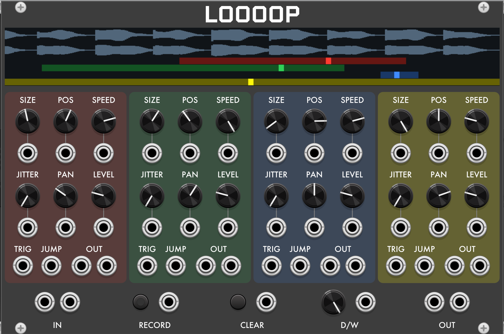
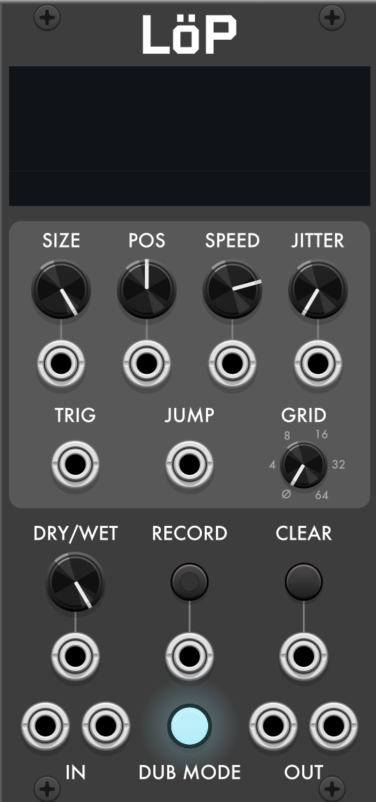

# Loooop

**Loooop** is a stereo, RAM-based looper for [VCV Rack](https://vcvrack.com) and the [4ms MetaModule](https://4mscompany.com/metamodule). You feed it audio, capture a loop, and then play that loop back through **four independent playheads** — each with its own speed, position, window size, level, jitter, and stereo pan. It's inspired by [Cutlasses Gloop](https://www.cutlasses.co.uk/product/gloop/).

Think of it as a multi-head tape playground: one recorded phrase can become four different loops running at four different speeds and lengths, all layered into a single stereo mix.

A smaller single-playhead version, **Löp**, is described [at the end](#löp).

---

## Quick start

1. **Patch some audio** into the **In L / In R** jacks at the bottom left. (Patch just one for mono — it feeds both sides.)
2. **Click Record**. The light turns on and Loooop starts capturing.
3. **Click Record again** to stop. The loop is now frozen and immediately starts playing back through all four heads.
4. Turn **Dry/Wet** all the way toward *Wet* if you only want to hear the loop, and monitor the output from **Mix L / Mix R** (bottom right).

> Loops can be up to **60 seconds** long. If you keep recording past that, Loooop stops on its own.

---

## The display

The strip across the top shows the recorded audio as a waveform. While you record, it fills in left-to-right. Once you have a loop, you'll see up to four colored **playhead markers** sweeping across it — one per head — along with a shaded band showing each head's *window* (the slice of the loop that head is allowed to play). This is the easiest way to see what Position, Size, and Speed are actually doing.

---

## The four playheads

Every head reads from the **same recorded loop**, but each has its own set of controls. At a given time, you might hear:

- Head 1 playing the whole loop forward at normal speed,
- Head 2 playing a short slice near the end, sped up,
- Head 3 running the loop backward and quietly,
- Head 4 wandering randomly around the middle.

All four are summed into the **Mix** output, each positioned in the stereo field by its own **Pan** knob. Each head also has its own pair of outputs if you want to process them separately.

### Per-head knobs

Each head has these controls, laid out in its own column:

* **Speed**: Playback rate. `1` = normal, `2` = double speed / up an octave, `0` = frozen. Turn it **below zero to play backward**.
* **Position**: *Where* in the loop this head plays — the center of its window. Sweep it to scrub through the recording.
* **Size**: *How much* of the loop this head plays, from a tiny grain up to the whole thing. Small Size + moving Position = scrubbing/granular textures.
* **Level**: This head's volume in the mix. (Defaults are set so all four heads at once add up to unity gain.)
* **Jitter**: Randomness. At `0` the window stays put; turn it up and the head jumps to a new random spot in the loop each time it repeats.
* **Pan**: Where this head sits in the stereo **Mix**. It only affects the Mix outputs; the head's own **Out L / R** jacks are unchanged.

*Position* and *Size* work together: **Size** sets the length of the slice, **Position** slides that slice around inside the loop. A head only ever loops within its own window.

> **Note that Position and Jitter need room to move.** At the **default Size (fully clockwise = the whole loop)**, a head's window already fills the entire recording, so there is nowhere for it to slide. **Position and Jitter will seem to do nothing until you turn Size down.** Once Size is below maximum, Position slides the window through the loop and Jitter randomizes where that window starts on each repeat. (To jump the *playhead* around inside a full-size window instead, use the per-head **Jump** input.)

---

## Recording controls

- **Record** — Starts and stops recording. The first press records a fresh loop. Once a loop exists, pressing Record again **overdubs** — what happens to the audio already in the loop depends on the **Write mode** menu setting (see below). Punch-in and punch-out are softened with a \~5 ms ramp, so starting and stopping an overdub doesn't record a click into the loop. The red light shows when Loooop is recording.
- **Clear** — Erases the loop and starts over.
- **Dry/Wet** — Global blend between your incoming audio (dry) and the loop playback (wet) at the Mix output. Fully clockwise = loop only.

---

## Jacks and CV

Nearly every knob has a **CV input** right below or beside it, and a full ±10 V sweep on a CV input covers that knob's entire range (the CV is added to the knob setting).

**Global jacks (bottom row):**

- **In L / In R** — audio in. Patch one for mono; it feeds both channels.
- **Record trigger** / **Clear trigger** — a trigger here does the same as clicking the Record / Clear buttons.
- **Mix L / Mix R** — the combined stereo output of all heads plus the dry/wet blend.

**Per-head jacks:**

- **Speed / Position / Size / Level / Jitter / Pan CV** — modulate that head's knob. (Pan is bipolar: about −5 V pushes hard left, +5 V hard right, centered at 0 V.)
- **Out L / Out R** — that head's isolated stereo output.
- **Trig** — retriggers the head (see below).
- **Jump** — a control voltage that snaps the playhead to a spot within its window (0 V = start of window, 10 V = end). Great for stutter and glitch effects driven by an LFO or sequencer.

### Trigger jacks and one-shot mode

Each head's **Trig** input behaves in one of two ways, chosen per head in the context menu:

- **Loop start** (default) — a trigger restarts the head at the beginning of its window. Use it to re-sync heads to a clock.
- **One-shot** — the head stays silent until triggered, then plays **through its window exactly once and stops**, ending with a short fade so it doesn't click. This turns a head into a sample-triggered one-shot player.

---

## Context menu

You can find these options by right-clicking the panel in VCV Rack or scrolling down to Options in MetaModule:

- **Overdub** — When on (the default), pressing Record over an existing loop records into it again, using the current **Write mode**. When off, the Record button does nothing while a loop exists — the loop is locked, and you'll need to **Clear** it before you can record again.
- **Write mode** — What an overdub pass does to the audio already in the loop:
  - **Add** (default) — new audio sums with what's there at full level, forever. The classic build-up-layers overdub.
  - **Replace** — new audio **overwrites** the loop as the record head passes. Punch in a new phrase over an old one.
  - **Layer** — sound-on-sound: each overdub pass turns the existing material down slightly (about 1 dB per pass), so older layers gradually sink underneath what you're playing now.
  - **Decay** — like Layer, but older layers also lose a little high end on every pass — tape-style degradation the longer you keep overdubbing.

  Layer and Decay only act **while you're recording** — a loop that's just playing back never fades on its own.
- **Crossfade loop seams** — When on (the default), Loooop applies a tiny (\~5 ms) fade at each loop's wrap-around point to hide clicks, and gives **one-shot** passes a matching fade-out at the end instead of a hard stop. Turn it off if you want the raw, seam-exact repeat (useful for rhythmic clicks or very short grains).
- **Grid** — Off (the default), 4, 8, or 16. When set, the loop is divided into that many equal segments, shown as vertical bars on the display, and every head's window snaps to them: **Size** becomes a whole number of segments and **Position** (including CV and **Jitter** offsets) lands on segment boundaries. Record a drum loop, set Grid to 16, and heads slice it cleanly on the beat.
- **Per head → Trigger** — pick *Loop start* or *One-shot* for that head (see above).
- **Per head → Speed CV is V/Oct** — makes that head's Speed CV input track **1 volt per octave**, so you can play the loop chromatically from a keyboard or sequencer (speed then ranges much wider, up to ±16×).

---

## Patch ideas

- **Instant harmonizer:** record a sustained note, then set the four heads to different Speeds (e.g. 1, 1.5, 2, and −1) for chords and shimmer.
- **Granular cloud:** shrink every head's **Size** right down, crank **Jitter**, and slowly sweep **Position**.
- **Stutter machine:** patch an LFO or sequencer into a head's **Jump** input.
- **Wide moving field:** spread the four heads across the stereo image with their **Pan** knobs, or patch slow, phase-offset LFOs into the Pan CVs so they drift around each other.
- **Rhythmic re-slicer:** record a drum loop, set each head to **One-shot** with a small window, and trigger them from a sequencer to rearrange the beat, and turn on **Grid** so every slice lands exactly on a division.
- **Separate processing:** take each head's own **Out L/R** into different reverbs, filters, or panners instead of using the combined Mix.

---

## Löp

**Löp** is Loooop with a **single playhead** instead of four. It works exactly like one head of Loooop — including the note above: turn **Size** down before **Position** and **Jitter** have anything to do. The context-menu options, including **Grid**, work the same as Loooop's.

