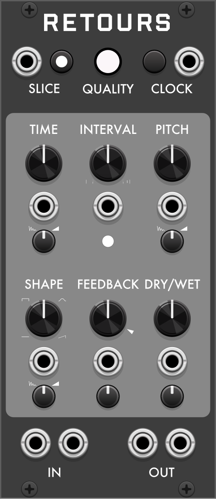
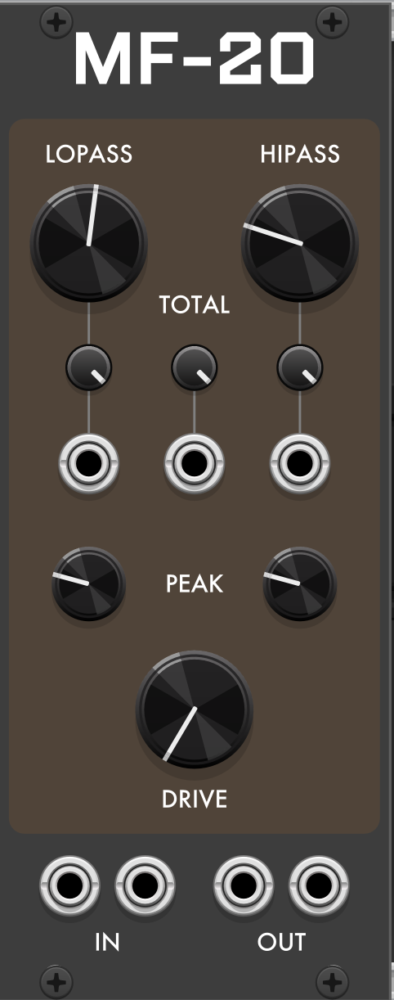
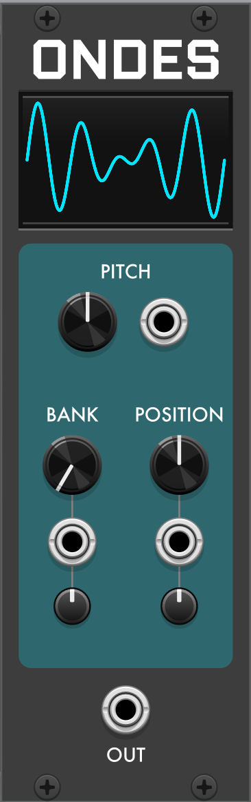
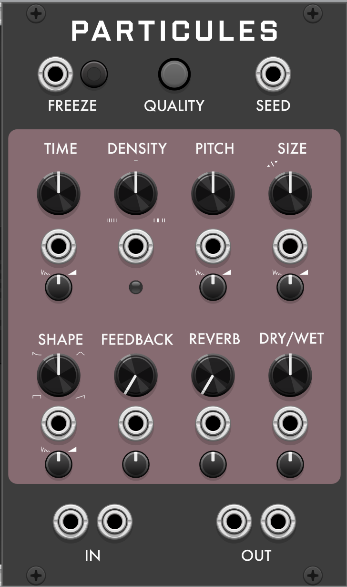

# Robot Boy

**Robot Boy** is a plugin for [VCV Rack](https://vcvrack.com) and the [4ms MetaModule](https://4mscompany.com/metamodule). It contains: 

* A recreation of Mutable Instruments Beads in three modules: 
	* **[Particules](Particules.md):** A granular texture processor.
	* **[Retours](Retours.md):** An unusual delay and beat-slicer. 
	* **[Ondes](Ondes.md):** A morphing wavetable oscillator.

* **[Loooop](Loooop.md):** A stereo looper with four independent playheads, and its smaller sibling **[Löp](Loooop.md#löp)**. 

* Three characterful stereo filter emulations — see the combined [character & history guide](Filters.md):
	* **[MF-20](MF20.md):** A Korg MS-20-style filter.
	* **[Onbetap](Onbetap.md):** A Polivoks-style multimode filter.
	* **[Vespid](Filters.md):** An emulation of the EDP Wasp state-variable filter.
---

## Retours

A delay and beat-slicer based on the hidden delay mode of Mutable Instruments Beads: manual, clocked, or tap-tempo delay times down to audio rates (Karplus-Strong), a beat-slicer, a pitch shifter in the feedback path, tempo-synced repeat shaping, and the four Beads recording-quality modes. → [**Full documentation**](Retours.md)

## Loooop

A stereo RAM looper: capture a loop, then play it back with four independent playheads, each with its own speed, position, window size, level, jitter, and pan. Get granular glitches and backward drones simultaneously. → [**Full documentation**](Loooop.md)

## Löp

The single-playhead version of Loooop, for when you just need a single loop. → [**Full documentation**](Loooop.md#löp)

## MF-20

An emulation of the Korg MS-20 filter (switchable between the OTA and Korg35 revisions). The cutoffs for the HP and LP stages can be controlled independently or from the shared Total bus. Optional added Drive. → [**Full documentation**](MF20.md) · [**Character & history**](Filters.md#mf-20--the-korg-ms-20-filter)

## Onbetap

A Polivoks-style stereo multimode filter: two integrator stages built from Soviet programmable op-amps in the original, with no capacitors in the signal path. Self-oscillates unpredictably at high resonance, and driving it hard suppresses that resonance rather than adding clean gain. A **Character** menu switches between a calibrated **Tamed** instance and a **Vintage** one with drift, channel mismatch, and DC thump. → [**Full documentation**](Onbetap.md) · [**Character & history**](Filters.md#onbetap--the-formanta-polivoks-filter)

## Ondes

A morphing wavetable oscillator: two knobs sweep across a two-dimensional set of 24 banks of 8 waveforms each. → [**Full documentation**](Ondes.md)

## Particules

A granular texture processor based on Mutable Instruments Beads. → [**Full documentation**](Particules.md)

## Vespid

A circuit-faithful emulation of the EDP Wasp's CMOS-inverter state-variable filter (CA3080 OTA integrators, diode resonance limiter, supply-rail clipping), based on the DAFx-2022 Köper/Holters/Esqueda/Parker model. Switch character in the right-click menu: **Tame** is the original 1978 Wasp (+5 V rails), sitting at the verge of oscillation for a whistle/chirp but never running away; **Screaming** is the Doepfer A-124's documented self-oscillation mod (+12 V rails), which crosses into true self-oscillation, bounded by the supply rails. Outputs are LP, BP, HP, and a Mix crossfade (LP–notch–HP) with its own CV. Freq tracks 1 V/oct; Freq, Res, and Drive all have CV inputs with attenuverters. Menu extras cover Accuracy (Standard/High-accuracy solver), Oversampling (Auto/1×/2×/4×), Input trim (±12 dB), Output level (±12 dB), and Inverter bandwidth (60–300 kHz, which tunes how eagerly it self-oscillates), and a Self-oscillation pitch option (hardware-accurate drift vs. corrected 1 V/oct tracking). Stereo (R normalled to L) and polyphonic. → [**Character & history**](Filters.md#vespid--the-edp-wasp-filter)
